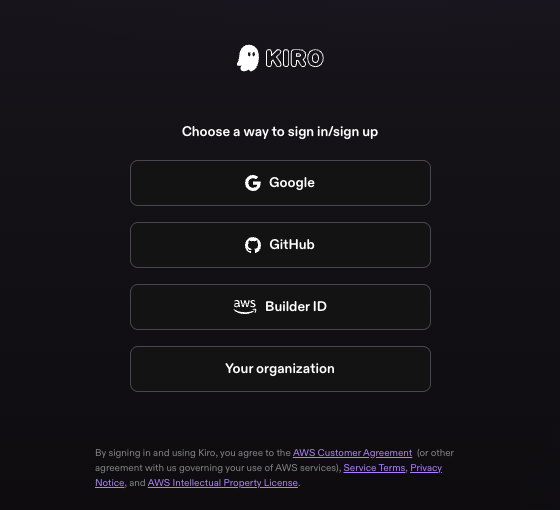
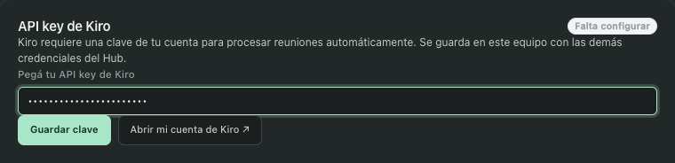
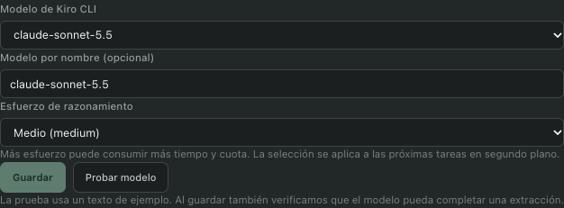

# Configurar la API key de Kiro en Agent Hub

Desde **Agent Hub 0.7.2**, seleccioná **Memoria → Fuentes y ajustes → Kiro CLI en segundo plano**. Aparece el campo **API key de Kiro** y, si falta una clave, una guía breve. Al guardarla, la guía se oculta; podés volver a desplegarla.

## 1. Obtener autorización y crear la clave

Entrá a [app.kiro.dev](https://app.kiro.dev) con la cuenta de tu suscripción.

Abrí **API Keys**, creá una clave con un nombre como **Agent Hub** y copiala al crearla. Kiro sólo muestra su valor completo en ese momento. Según su documentación, está disponible para **Pro, Pro+, Pro Max y Power** y consume créditos de la suscripción. [Instrucciones oficiales](https://kiro.dev/docs/getting-started/authentication/#generate-an-api-key).

**Si API Keys está deshabilitado para tu organización**, solicitá su habilitación al administrador antes de continuar. Tener una sesión abierta en la CLI no reemplaza esa autorización. Podés enviarle este texto:

> Necesito usar Kiro CLI en modo no interactivo desde Agent Hub para procesar transcripciones de reuniones autorizadas. API Keys aparece deshabilitado para nuestra organización. ¿Pueden revisar la política y habilitar ese uso, o indicarme la alternativa aprobada y sus límites?

## 2. Guardarla en el Hub

Pegá la clave en **API key de Kiro** y pulsá **Guardar clave**. El campo oculta su contenido y queda vacío después de guardarla. **Guardada en este equipo** confirma el almacenamiento; todavía hay que probar el acceso.

No hace falta usar la terminal, configurar variables de entorno ni reiniciar la app. El Hub la guarda localmente con sus demás credenciales y sólo la entrega al proceso de Kiro. No aparece en el catálogo, las respuestas de configuración ni los respaldos de memoria.

## 3. Probar y habilitar el procesamiento

Elegí modelo y esfuerzo de razonamiento y pulsá **Probar modelo**. La prueba usa un texto sintético y consume cuota.

Si responde correctamente, habilitá el envío de fragmentos y pulsá **Guardar configuración**. Guardar vuelve a verificar la combinación elegida antes de aplicarla a las próximas tareas.

Si Kiro rechaza el acceso, revisá con tu administrador la vigencia de la clave, los créditos y los modelos permitidos. No compartas la clave en chats, tickets ni capturas.

## Reemplazar o quitar la clave

Para rotarla, pegá la nueva y pulsá **Reemplazar clave**. **Quitar clave guardada** elimina la copia local, pero no la revoca en Kiro: la revocación se hace en **API Keys** dentro de tu cuenta. Al quedar sin clave, reaparece la guía.

Capturas tomadas el 7 de octubre de 2026: acceso público de Kiro y controles reales de Agent Hub con datos de demostración. No muestran una clave real ni una prueba de acceso exitosa. La validación con la cuenta de la organización queda pendiente hasta que habilite la creación de claves.
